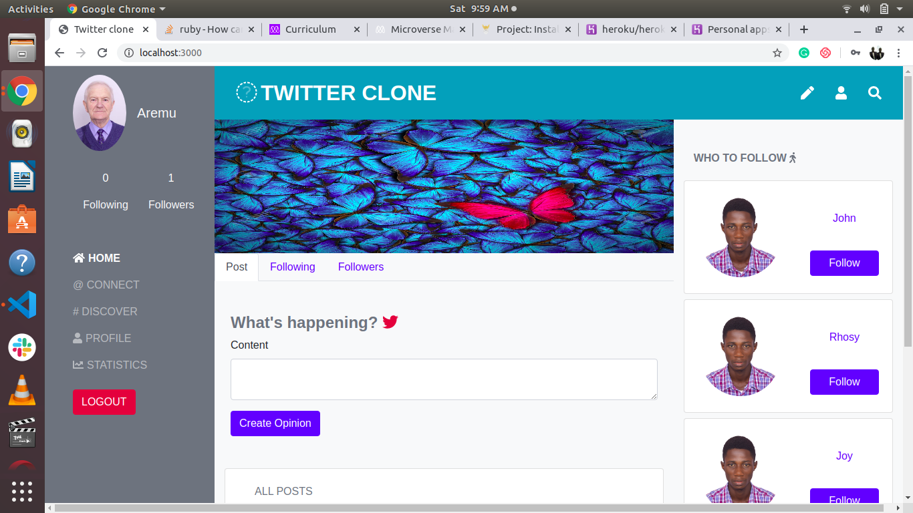
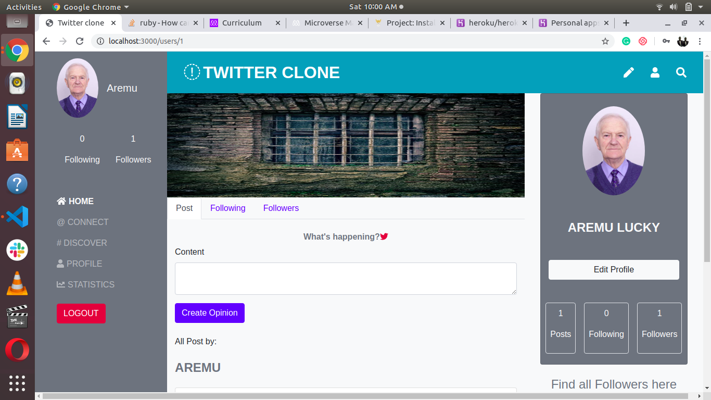

 Twitter redesign page - RoR Capstone Project

This project is to redesign the popular social media applications called Twitter with ruby on rails 

Home page



Profile page


## What it does

Its Twitter clone.

*As a guest user:*

- You will be able to create account/log in.
- You can see only “Sign in” and “Sign out” page.

*As a logged-in user:*

- You will be able to see all users list.
- You will be able to see selected user page with their user name and all Posts written by them (the most recent posts on the top).
- You will be able to follow a user.
- You will see a button “Follow” next to the name of user who your are not following yet - on both users’ list and single user page.
- You will be able to create new Post (text only).

- You will be able to add comments to Posts.
- You will be able to see “Timeline” page with Posts (with number of  comments) written by you and all the users you are following (the most recent posts on the top).
- Timeline page is the root page of the app.

## Built With

- Ruby v2.6.5
- Ruby on Rails v5.2.3

*Gems used:*

- Devise (for user authentication)
- Simple_form
- Faker
- Will Paginate
- Gems used for testing:
  - Capybara
  - Selenium webdriver
  - Chromedriver helper
  - Database cleaner
  - Rspec-rails
  - Shoulda matchers

- Rubocop

## Live Demo

[Live Demo Link](https://glacial-gorge-46936.herokuapp.com/users/sign_in)

## Video Presentation


[Watch the video](https://www.loom.com/share/c3f14f7d14ef403ca45993f1a1314db6)


## Getting Started

To get a local copy up, clone it and running follow these simple example steps.

### Prerequisites

- Ruby: 2.6.5
- Rails: 5.2.3
- Postgres: >= 9.5

### Setup

Install gems with:

``` bash
bundle install
```

Setup database with:

``` bash
   rails db:create
   rails db:migrate
```

Create users with:


### Usage

Start server with:

``` bash
    rails server
```

Open `http://localhost:3000/` in your browser.

### Run tests

``` bash
    rpsec
```

### Deployment

- App deployed in Heroku.

## Author

👤 **Aremu Lucky Baba**

- Github: [@Luckyaremu](https://github.com/Luckyaremu)
- Twitter: [@Luckyaremu]
- Linkedin: [Aremu Lucky Baba](https://www.linkedin.com/in/lucky-aremu-24807a145/)

## 🤝 Contributing

Contributions, issues and feature requests are welcome! Start by:

- Forking the project.
- Cloning the project to your local machine.
- cd into the project directory.
- Run git checkout -b your-branch-name.
- Make your contributions.
- Push your branch up to your forked repository.
- Open a Pull Request with a detailed description to the development branch of the original project for a review.

## Show your support

Give a ⭐️ if you like this project!

## Acknowledgments

- Microverse
- [Gregoire Veila](https://www.behance.net/gallery/14286087/Twitter-Redesign-of-UI-details)

## 📝 License

No license.
